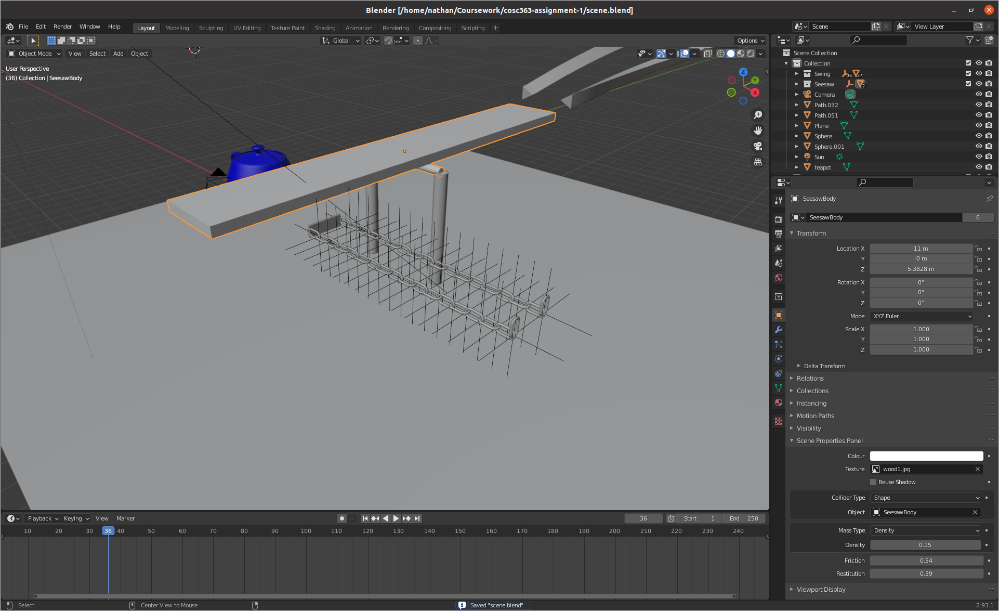
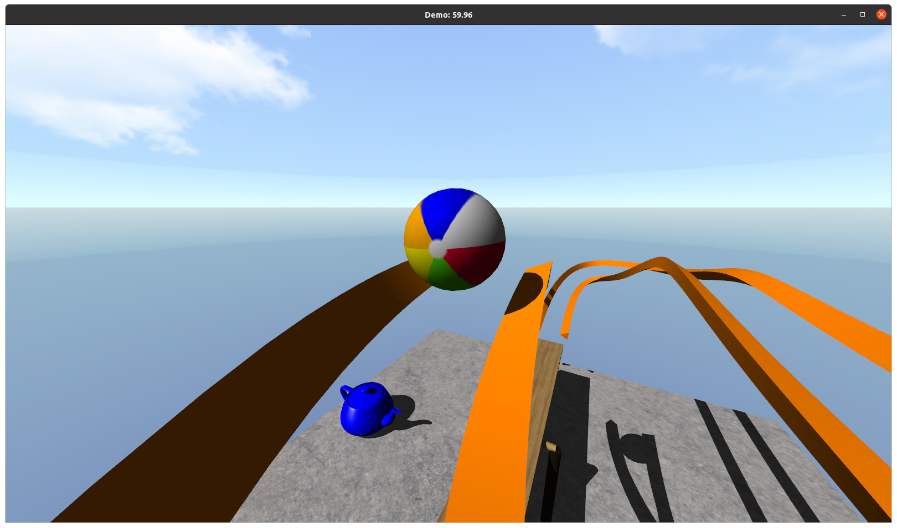
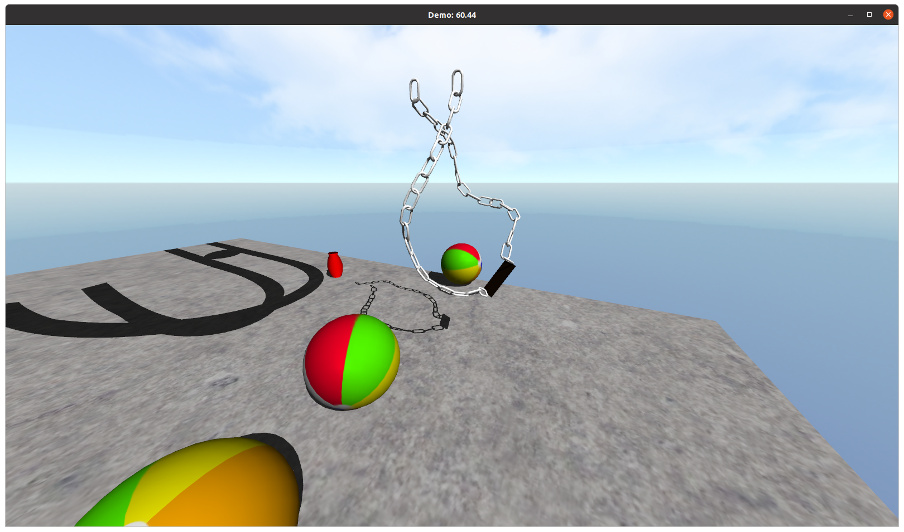
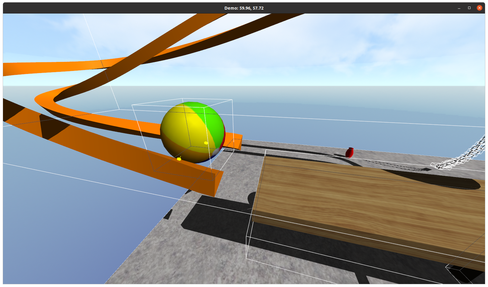
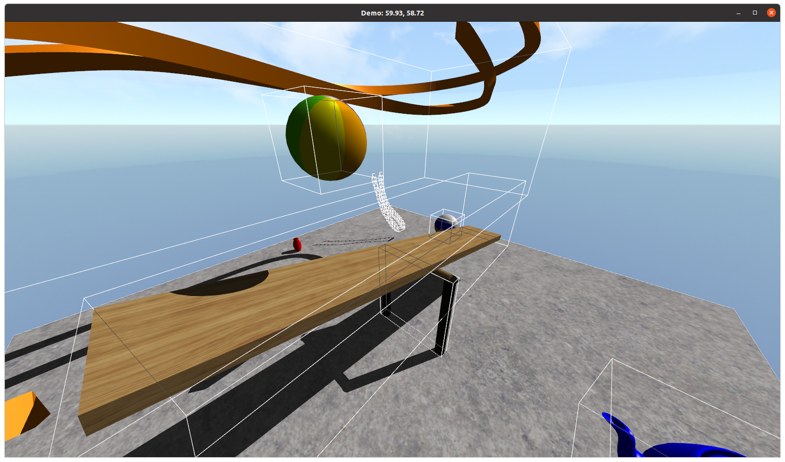

# COSC363 - OpenGL 1.X Assignment

## Features
 - Custom blender addon for scene creation
 - Dynamic shadows using shadow volumes
 - Constraint based physics system

## Usage
```bash
git submodule init
git submodule update

# Build
mkdir build
cd build
cmake ..
cmake --build .

# Run
cd ..
./build/Assignment # Use default scene (at res/scene.json)
# or
./build/Assignment /path/to/scene.json
```

## Controls
 - WASD - Move horisontally
 - QE - Move vertically
 - Shift - Slow down movement
 - Control - Speed up movement
 - Right click - Capture/Uncapture mouse 
 - Numpad - Alternative camera direction control
 - Space - Throw ball
 - R - Reload scene
 - P - Pause simulation
 - T - Single step simulation
 - IK - Change simulation speed
 - O - Show debug overlay


## Screenshots






